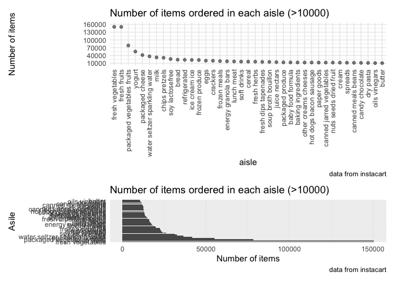

p8105_hw3_xx2416
================
Xicheng Xie
2022-10-10

\#load packages

``` r
library(tidyverse)
```

    ## ── Attaching packages ─────────────────────────────────────── tidyverse 1.3.2 ──
    ## ✔ ggplot2 3.3.6      ✔ purrr   0.3.4 
    ## ✔ tibble  3.1.8      ✔ dplyr   1.0.10
    ## ✔ tidyr   1.2.0      ✔ stringr 1.4.1 
    ## ✔ readr   2.1.2      ✔ forcats 0.5.2 
    ## ── Conflicts ────────────────────────────────────────── tidyverse_conflicts() ──
    ## ✖ dplyr::filter() masks stats::filter()
    ## ✖ dplyr::lag()    masks stats::lag()

``` r
library(patchwork)
```

# Problem 1

### data import

``` r
library(p8105.datasets)
data("instacart")
```

This dataset contains 1384617 rows and 15 columns. Key variables of this
dataset include `aisle` and `aisle_id`, which denote the name and
identifier of the aisle, `product_id` and `product_name`, which denote
the identifier and name of the product, `department_id` and
`department`, which denote the identifier and name of the department,
`order_dow` and `order_hour_of_day`, which denote the the day of the
week and the hour of the day on which the order was placed,
`days_since_prior_order`, which denotes days since the last order. Other
variables not involved are out of interest for other research purposes.
\### illstrative examples of observations For example, in the first 8
consecutive rows, there are eight products bought by user \#112108 in
his/her 4th purchase at 10 am on Thursday, 9 days since his/her last
order. The fist product is Bulgarian Yogurt in the **yogurt** aisle of
the **dairy eggs** department.

``` r
instacart[1:8,]
```

    ## # A tibble: 8 × 15
    ##   order_id product_id add_to_c…¹ reord…² user_id eval_…³ order…⁴ order…⁵ order…⁶
    ##      <int>      <int>      <int>   <int>   <int> <chr>     <int>   <int>   <int>
    ## 1        1      49302          1       1  112108 train         4       4      10
    ## 2        1      11109          2       1  112108 train         4       4      10
    ## 3        1      10246          3       0  112108 train         4       4      10
    ## 4        1      49683          4       0  112108 train         4       4      10
    ## 5        1      43633          5       1  112108 train         4       4      10
    ## 6        1      13176          6       0  112108 train         4       4      10
    ## 7        1      47209          7       0  112108 train         4       4      10
    ## 8        1      22035          8       1  112108 train         4       4      10
    ## # … with 6 more variables: days_since_prior_order <int>, product_name <chr>,
    ## #   aisle_id <int>, department_id <int>, aisle <chr>, department <chr>, and
    ## #   abbreviated variable names ¹​add_to_cart_order, ²​reordered, ³​eval_set,
    ## #   ⁴​order_number, ⁵​order_dow, ⁶​order_hour_of_day

### Qustion 1

How many aisles are there, and which aisles are the most items ordered
from?

``` r
instacart %>% 
  group_by(aisle) %>% 
  summarise(n_obs=n()) %>% 
  arrange(desc(n_obs))
```

    ## # A tibble: 134 × 2
    ##    aisle                          n_obs
    ##    <chr>                          <int>
    ##  1 fresh vegetables              150609
    ##  2 fresh fruits                  150473
    ##  3 packaged vegetables fruits     78493
    ##  4 yogurt                         55240
    ##  5 packaged cheese                41699
    ##  6 water seltzer sparkling water  36617
    ##  7 milk                           32644
    ##  8 chips pretzels                 31269
    ##  9 soy lactosefree                26240
    ## 10 bread                          23635
    ## # … with 124 more rows

There are 134 different aisles in this dataset. `Fresh vegetables` is
the aisle in which the most items order from (150609 items),
`fresh fruits` is the second most frequently ordered aisle with 150473
items ordered.

### Question 2

Make a plot that shows the number of items ordered in each aisle,
limiting this to aisles with more than 10000 items ordered. Arrange
aisles sensibly, and organize your plot so others can read it.

``` r
instacart %>% 
  group_by(aisle) %>% 
  summarize(n_obs=n()) %>% 
  filter(n_obs>10000) %>% 
  mutate(aisle=fct_reorder(aisle,n_obs,.desc = TRUE)) %>% 
  ggplot(aes(x=aisle,y=n_obs))+
  geom_point(alpha = .5)+
  labs(
    title="Number of items ordered in each aisle (>10000)",
    y="Number of items",
    caption = "data from instacart"
  )+
  theme(axis.text.x = element_text(angle = 90,vjust=0.5 ,hjust = 1))+
  scale_y_continuous(breaks = seq(10000,200000,by=30000),limits = c(10000,160000))
```

<!-- -->

### Question 3

Make a table showing the three most popular items in each of the aisles
“baking ingredients”, “dog food care”, and “packaged vegetables fruits”.
Include the number of times each item is ordered in your table.

``` r
instacart %>% 
  group_by(aisle,product_name) %>%
  filter(aisle %in% c("baking ingredients", "dog food care","packaged vegetables fruits")) %>% 
  summarize(n_obs=n()) %>% 
  mutate(times_ranking=min_rank(desc(n_obs))) %>% 
  filter(times_ranking<4) %>% 
  select(aisle,product_name,n_obs) %>% 
  arrange(desc(n_obs)) %>% 
  knitr::kable(
    col.names = c("Aisle","Top 3 popular items","Number of orders"),
    align = "llc",
    caption = "Top 3 popular items from certain aisles")
```

    ## `summarise()` has grouped output by 'aisle'. You can override using the
    ## `.groups` argument.

| Aisle                      | Top 3 popular items                           | Number of orders |
|:---------------------------|:----------------------------------------------|:----------------:|
| packaged vegetables fruits | Organic Baby Spinach                          |       9784       |
| packaged vegetables fruits | Organic Raspberries                           |       5546       |
| packaged vegetables fruits | Organic Blueberries                           |       4966       |
| baking ingredients         | Light Brown Sugar                             |       499        |
| baking ingredients         | Pure Baking Soda                              |       387        |
| baking ingredients         | Cane Sugar                                    |       336        |
| dog food care              | Snack Sticks Chicken & Rice Recipe Dog Treats |        30        |
| dog food care              | Organix Chicken & Brown Rice Recipe           |        28        |
| dog food care              | Small Dog Biscuits                            |        26        |

Top 3 popular items from certain aisles

As intuitively presented in the table, \* In the
`packaged vegetables fruits` aisle, the top 3 popular items are
`Organic Baby Spinach` with 9784 order times, `Organic Raspberries` with
5546 order times, and `Organic Blueberries` with 4966 order times. \* In
the `baking ingredients` aisle, the top 3 popular items are
`Light Brown Sugar` with 499 order times, `Pure Baking Soda` with 387
order times, and `Cane Sugar` with 336 order times. \* In the
`dog food care` aisle, the top 3 popular items are
`Snack Sticks Chicken & Rice Recipe Dog Treats`,
`Organix Chicken & Brown Rice Recipe`, and `Small Dog Biscuits`, with
30, 28, and 26 order times respectively.

### Question 4

Make a table showing the mean hour of the day at which Pink Lady Apples
and Coffee Ice Cream are ordered on each day of the week; format this
table for human readers (i.e. produce a 2 x 7 table).

``` r
instacart %>% 
  filter(product_name %in% c("Pink Lady Apples","Coffee Ice Cream")) %>%
  mutate(order_dow=recode_factor(order_dow,
    `0`="Sun",`1`="Mon",`2`="Tue",`3`="Wed",`4`="Thu",`5`="Fri",`6`="Sat"
  )) %>% 
  group_by(product_name,order_dow) %>%
  summarize(mean_orhd=mean(order_hour_of_day)) %>%
  select(product_name,order_dow,mean_orhd) %>% 
  pivot_wider(
    names_from = order_dow,
    values_from = mean_orhd
  ) %>% 
  knitr::kable(digits = 2)
```

    ## `summarise()` has grouped output by 'product_name'. You can override using the
    ## `.groups` argument.

| product_name     |   Sun |   Mon |   Tue |   Wed |   Thu |   Fri |   Sat |
|:-----------------|------:|------:|------:|------:|------:|------:|------:|
| Coffee Ice Cream | 13.77 | 14.32 | 15.38 | 15.32 | 15.22 | 12.26 | 13.83 |
| Pink Lady Apples | 13.44 | 11.36 | 11.70 | 14.25 | 11.55 | 12.78 | 11.94 |
