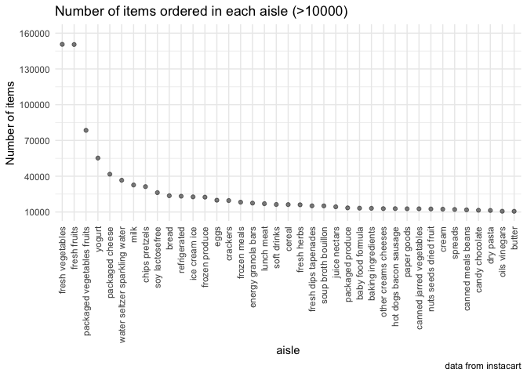
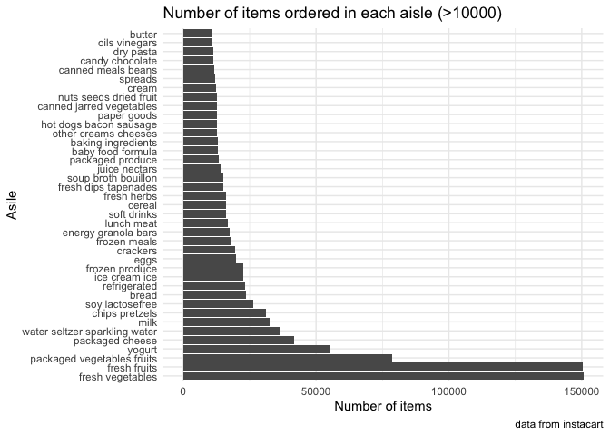
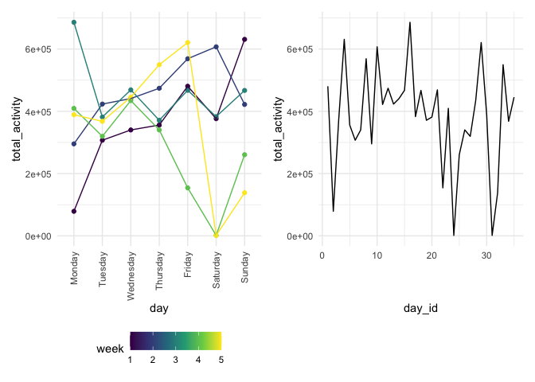
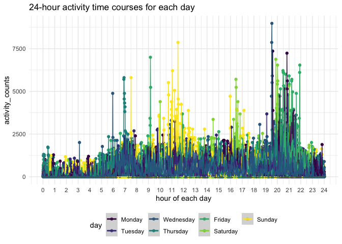
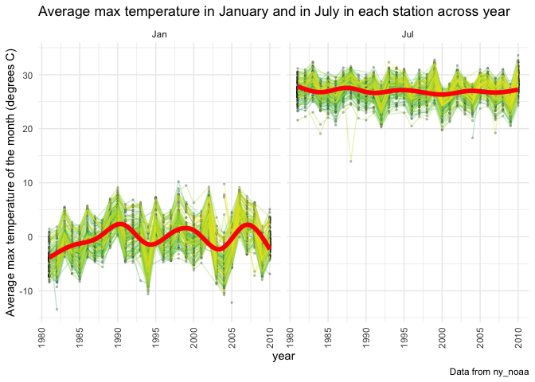
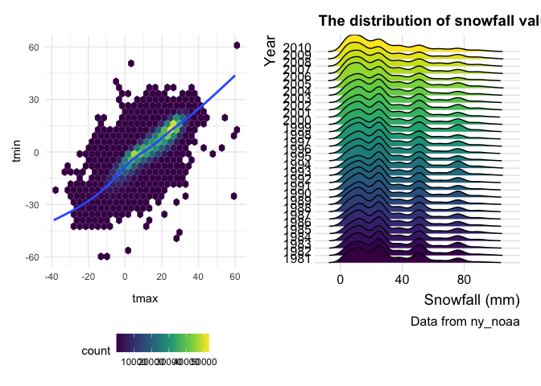

p8105_hw3_xx2416
================
Xicheng Xie
2022-10-10

\#load packages

``` r
library(tidyverse)
```

    ## ── Attaching packages ─────────────────────────────────────── tidyverse 1.3.2 ──
    ## ✔ ggplot2 3.3.6      ✔ purrr   0.3.4 
    ## ✔ tibble  3.1.8      ✔ dplyr   1.0.10
    ## ✔ tidyr   1.2.0      ✔ stringr 1.4.1 
    ## ✔ readr   2.1.2      ✔ forcats 0.5.2 
    ## ── Conflicts ────────────────────────────────────────── tidyverse_conflicts() ──
    ## ✖ dplyr::filter() masks stats::filter()
    ## ✖ dplyr::lag()    masks stats::lag()

``` r
library(patchwork)
library(ggridges)
knitr::opts_chunk$set(
  out.width = "90%"
)

theme_set(theme_minimal() + theme(legend.position = "bottom"))

options(
  ggplot2.continuous.colour = "viridis",
  ggplot2.continuous.fill = "viridis"
)

scale_colour_discrete = scale_colour_viridis_d
scale_fill_discrete = scale_fill_viridis_d
```

# Problem 1

### data import

``` r
library(p8105.datasets)
data("instacart")
```

This dataset contains 1384617 rows and 15 columns. Key variables of this
dataset include `aisle` and `aisle_id`, which denote the name and
identifier of the aisle, `product_id` and `product_name`, which denote
the identifier and name of the product, `department_id` and
`department`, which denote the identifier and name of the department,
`order_dow` and `order_hour_of_day`, which denote the the day of the
week and the hour of the day on which the order was placed,
`days_since_prior_order`, which denotes days since the last order. Other
variables not involved are out of interest for other research purposes.
\### illstrative examples of observations For example, in the first 8
consecutive rows, there are eight products bought by user \#112108 in
his/her 4th purchase at 10 am on Thursday, 9 days since his/her last
order. The fist product is Bulgarian Yogurt in the **yogurt** aisle of
the **dairy eggs** department.

``` r
instacart[1:8,]
```

    ## # A tibble: 8 × 15
    ##   order_id product_id add_to_c…¹ reord…² user_id eval_…³ order…⁴ order…⁵ order…⁶
    ##      <int>      <int>      <int>   <int>   <int> <chr>     <int>   <int>   <int>
    ## 1        1      49302          1       1  112108 train         4       4      10
    ## 2        1      11109          2       1  112108 train         4       4      10
    ## 3        1      10246          3       0  112108 train         4       4      10
    ## 4        1      49683          4       0  112108 train         4       4      10
    ## 5        1      43633          5       1  112108 train         4       4      10
    ## 6        1      13176          6       0  112108 train         4       4      10
    ## 7        1      47209          7       0  112108 train         4       4      10
    ## 8        1      22035          8       1  112108 train         4       4      10
    ## # … with 6 more variables: days_since_prior_order <int>, product_name <chr>,
    ## #   aisle_id <int>, department_id <int>, aisle <chr>, department <chr>, and
    ## #   abbreviated variable names ¹​add_to_cart_order, ²​reordered, ³​eval_set,
    ## #   ⁴​order_number, ⁵​order_dow, ⁶​order_hour_of_day

### Qustion 1

How many aisles are there, and which aisles are the most items ordered
from?

``` r
instacart %>% 
  group_by(aisle) %>% 
  summarise(n_obs=n()) %>% 
  arrange(desc(n_obs))
```

    ## # A tibble: 134 × 2
    ##    aisle                          n_obs
    ##    <chr>                          <int>
    ##  1 fresh vegetables              150609
    ##  2 fresh fruits                  150473
    ##  3 packaged vegetables fruits     78493
    ##  4 yogurt                         55240
    ##  5 packaged cheese                41699
    ##  6 water seltzer sparkling water  36617
    ##  7 milk                           32644
    ##  8 chips pretzels                 31269
    ##  9 soy lactosefree                26240
    ## 10 bread                          23635
    ## # … with 124 more rows

There are 134 different aisles in this dataset. `Fresh vegetables` is
the aisle in which the most items order from (150609 items),
`fresh fruits` is the second most frequently ordered aisle with 150473
items ordered.

### Question 2

Make a plot that shows the number of items ordered in each aisle,
limiting this to aisles with more than 10000 items ordered. Arrange
aisles sensibly, and organize your plot so others can read it.

To make the plot more readable, I make a point and a bar plot
respectively.

``` r
  instacart %>% 
  group_by(aisle) %>% 
  summarize(n_obs=n()) %>% 
  filter(n_obs>10000) %>% 
  mutate(aisle=fct_reorder(aisle,n_obs,.desc = TRUE)) %>% 
  ggplot(aes(x=aisle,y=n_obs))+
  geom_point(alpha = .5)+
  labs(
    title="Number of items ordered in each aisle (>10000)",
    y="Number of items",
    caption = "data from instacart"
  )+
  theme(axis.text.x = element_text(angle = 90,vjust=0.5 ,hjust = 1))+
  scale_y_continuous(breaks = seq(10000,200000,by=30000),limits = c(10000,160000))
```



``` r
  instacart %>% 
  group_by(aisle) %>% 
  summarize(n_obs=n()) %>% 
  filter(n_obs>10000) %>% 
  mutate(aisle=fct_reorder(aisle,n_obs,.desc = TRUE)) %>% 
  ggplot(aes(x=aisle,y=n_obs))+
  geom_col()+
  coord_flip()+
  labs(
    title="Number of items ordered in each aisle (>10000)",
    y="Number of items",
    x="Asile",
    caption = "data from instacart"
  )+
  theme(legend.position = "bottom")
```



### Question 3

Make a table showing the three most popular items in each of the aisles
“baking ingredients”, “dog food care”, and “packaged vegetables fruits”.
Include the number of times each item is ordered in your table.

``` r
instacart %>% 
  group_by(aisle,product_name) %>%
  filter(aisle %in% c("baking ingredients", "dog food care","packaged vegetables fruits")) %>% 
  summarize(n_obs=n()) %>% 
  mutate(times_ranking=min_rank(desc(n_obs))) %>% 
  filter(times_ranking<4) %>% 
  select(aisle,product_name,n_obs) %>% 
  arrange(desc(n_obs)) %>% 
  knitr::kable(
    col.names = c("Aisle","Top 3 popular items","Number of orders"),
    align = "llc",
    caption = "Top 3 popular items from certain aisles")
```

    ## `summarise()` has grouped output by 'aisle'. You can override using the
    ## `.groups` argument.

| Aisle                      | Top 3 popular items                           | Number of orders |
|:---------------------------|:----------------------------------------------|:----------------:|
| packaged vegetables fruits | Organic Baby Spinach                          |       9784       |
| packaged vegetables fruits | Organic Raspberries                           |       5546       |
| packaged vegetables fruits | Organic Blueberries                           |       4966       |
| baking ingredients         | Light Brown Sugar                             |       499        |
| baking ingredients         | Pure Baking Soda                              |       387        |
| baking ingredients         | Cane Sugar                                    |       336        |
| dog food care              | Snack Sticks Chicken & Rice Recipe Dog Treats |        30        |
| dog food care              | Organix Chicken & Brown Rice Recipe           |        28        |
| dog food care              | Small Dog Biscuits                            |        26        |

Top 3 popular items from certain aisles

As intuitively presented in the table, \* In the
`packaged vegetables fruits` aisle, the top 3 popular items are
`Organic Baby Spinach` with 9784 order times, `Organic Raspberries` with
5546 order times, and `Organic Blueberries` with 4966 order times. \* In
the `baking ingredients` aisle, the top 3 popular items are
`Light Brown Sugar` with 499 order times, `Pure Baking Soda` with 387
order times, and `Cane Sugar` with 336 order times. \* In the
`dog food care` aisle, the top 3 popular items are
`Snack Sticks Chicken & Rice Recipe Dog Treats`,
`Organix Chicken & Brown Rice Recipe`, and `Small Dog Biscuits`, with
30, 28, and 26 order times respectively.

### Question 4

Make a table showing the mean hour of the day at which Pink Lady Apples
and Coffee Ice Cream are ordered on each day of the week; format this
table for human readers (i.e. produce a 2 x 7 table).

``` r
instacart %>% 
  filter(product_name %in% c("Pink Lady Apples","Coffee Ice Cream")) %>%
  mutate(order_dow=recode_factor(order_dow,
    `0`="Sun",`1`="Mon",`2`="Tue",`3`="Wed",`4`="Thu",`5`="Fri",`6`="Sat"
  )) %>% 
  group_by(product_name,order_dow) %>%
  summarize(mean_orhd=mean(order_hour_of_day)) %>%
  select(product_name,order_dow,mean_orhd) %>% 
  pivot_wider(
    names_from = order_dow,
    values_from = mean_orhd
  ) %>% 
  knitr::kable(digits = 2)
```

    ## `summarise()` has grouped output by 'product_name'. You can override using the
    ## `.groups` argument.

| product_name     |   Sun |   Mon |   Tue |   Wed |   Thu |   Fri |   Sat |
|:-----------------|------:|------:|------:|------:|------:|------:|------:|
| Coffee Ice Cream | 13.77 | 14.32 | 15.38 | 15.32 | 15.22 | 12.26 | 13.83 |
| Pink Lady Apples | 13.44 | 11.36 | 11.70 | 14.25 | 11.55 | 12.78 | 11.94 |

# Problem 2

### Question 1

Load, tidy, and otherwise wrangle the data.

``` r
accel_df<-
  read_csv("accel_data.csv") %>% 
  janitor::clean_names() %>% 
  mutate(
    day=factor(day,levels = c("Monday", "Tuesday", "Wednesday", "Thursday", "Friday", "Saturday", "Sunday")),
    day_kind=case_when(
    day %in% c("Monday","Tuesday","Wednesday","Thursday","Friday")~"weekday",
    day %in% c("Sunday","Saturday")~"weekend"),
    day_kind=factor(day_kind,levels = c("weekday","weekend"))) %>%
  pivot_longer(
    starts_with("activity_"),
    names_to = "activity.*",
    names_prefix = "activity_",
    values_to = "activity_counts"
    )
```

    ## Rows: 35 Columns: 1443
    ## ── Column specification ────────────────────────────────────────────────────────
    ## Delimiter: ","
    ## chr    (1): day
    ## dbl (1442): week, day_id, activity.1, activity.2, activity.3, activity.4, ac...
    ## 
    ## ℹ Use `spec()` to retrieve the full column specification for this data.
    ## ℹ Specify the column types or set `show_col_types = FALSE` to quiet this message.

In the tidied new dataset `accel_df`, there are 50400 observations, and
key variables include `week`,`day_id`,`day`, which is converted to
factor variable, `day_kind`, which denote weekday or weekend of the
observation day, `activity.*` denote the activity counts for each minute
of a 24-hour day starting at midnight, and `activity_counts` variable
contains the counting value.

### Question 2

Traditional analyses of accelerometer data focus on the total activity
over the day. Using your tidied dataset, aggregate across minutes to
create a total activity variable for each day, and create a table
showing these totals. Are any trends apparent?

``` r
accel_df %>% 
  group_by(week,day) %>% 
  summarize(total_activity=sum(activity_counts)) %>% 
  pivot_wider(
    names_from = day,
    values_from = total_activity
  ) %>% 
  knitr::kable(digits = 2,
               align = 'lccccccc',
               caption = "Total activity over each day in each week"
  )
```

    ## `summarise()` has grouped output by 'week'. You can override using the
    ## `.groups` argument.

| week |  Monday   | Tuesday  | Wednesday | Thursday |  Friday  | Saturday | Sunday |
|:-----|:---------:|:--------:|:---------:|:--------:|:--------:|:--------:|:------:|
| 1    | 78828.07  | 307094.2 |  340115   | 355923.6 | 480542.6 |  376254  | 631105 |
| 2    | 295431.00 | 423245.0 |  440962   | 474048.0 | 568839.0 |  607175  | 422018 |
| 3    | 685910.00 | 381507.0 |  468869   | 371230.0 | 467420.0 |  382928  | 467052 |
| 4    | 409450.00 | 319568.0 |  434460   | 340291.0 | 154049.0 |   1440   | 260617 |
| 5    | 389080.00 | 367824.0 |  445366   | 549658.0 | 620860.0 |   1440   | 138421 |

Total activity over each day in each week

The table of total activity on each day is shown above. To better
discover the trends, two maps are made and presented.

``` r
total_trend1<-
  accel_df %>% 
  group_by(week,day) %>% 
  summarize(total_activity=sum(activity_counts)) %>% 
  ggplot(aes(x=day,y=total_activity,color=week))+
  geom_point()+
  geom_line(aes(group=week))+
  theme(axis.text.x = element_text(angle = 90,vjust=0.5 ,hjust = 1))
```

    ## `summarise()` has grouped output by 'week'. You can override using the
    ## `.groups` argument.

``` r
total_trend2<-
  accel_df %>% 
  group_by(day_id) %>% 
  summarize(total_activity=sum(activity_counts)) %>% 
  ggplot(aes(x=day_id,y=total_activity))+
  geom_line()

total_trend1+total_trend2
```


Actually, I don’t find any trends showed based on the data above.

### Question 3

Make a single-panel plot that shows the 24-hour activity time courses
for each day and use color to indicate day of the week.

``` r
accel_df %>%
  mutate(`activity.*` = as.integer(`activity.*`)) %>% 
  ggplot(aes(x=`activity.*`,y=activity_counts,group=day_id,color=day))+
  geom_point()+
  geom_line()+
  geom_smooth()+
  scale_x_continuous(
    breaks = (0:24)*60,
    labels = 0:24
  )+
  labs(
    x="hour of each day",
    title = "24-hour activity time courses for each day"
  )
```

    ## `geom_smooth()` using method = 'gam' and formula 'y ~ s(x, bs = "cs")'

    ## Warning: Computation failed in `stat_smooth()`:
    ## NA/NaN/Inf in foreign function call (arg 3)



# Problem 3

### data import

``` r
library(p8105.datasets)
data("ny_noaa")
```

### do some exploration of this dataset

In the dataset `ny_noaa`, there are 2595176 rows and 7 columns. The key
variables of this df include `id`, Weather station ID, `date`, Date of
observation, `prcp`, Precipitation (tenths of mm), `snow`, Snowfall
(mm), `snwd`, Snow depth (mm), `tmax`, Maximum temperature (tenths of
degrees C), and `tmin`, Minimum temperature (tenths of degrees C). There
are 747 different weather stations. Since each weather station may
collect only a subset of these variables, the resulting dataset contains
extensive missing data.

### Missing data analysis

``` r
ny_noaa %>% 
  janitor::clean_names() %>%
  summarise_all(funs(100*mean(is.na(.)))) %>% 
  knitr::kable(digits = 2,
               caption="Proportion of missing values for all variables")
```

    ## Warning: `funs()` was deprecated in dplyr 0.8.0.
    ## Please use a list of either functions or lambdas: 
    ## 
    ##   # Simple named list: 
    ##   list(mean = mean, median = median)
    ## 
    ##   # Auto named with `tibble::lst()`: 
    ##   tibble::lst(mean, median)
    ## 
    ##   # Using lambdas
    ##   list(~ mean(., trim = .2), ~ median(., na.rm = TRUE))
    ## This warning is displayed once every 8 hours.
    ## Call `lifecycle::last_lifecycle_warnings()` to see where this warning was generated.

|  id | date | prcp |  snow | snwd |  tmax |  tmin |
|----:|-----:|-----:|------:|-----:|------:|------:|
|   0 |    0 | 5.62 | 14.69 | 22.8 | 43.71 | 43.71 |

Proportion of missing values for all variables

The missing value proportion of all the variables is shown in the table
above. `tmax` and `tmin` contain high percentage of missing values,
which are 43.71%, then following `snwd` and `snow`. The high percentage
of missing values in the variables will undoubtedly affect the stability
of the data analysis results.

### Do some data cleaning

Create separate variables for year, month, and day. Ensure observations
for temperature, precipitation, and snowfall are given in reasonable
units.

``` r
ny_noaa_df<-
  ny_noaa %>% 
  janitor::clean_names() %>% 
  separate(date,into = c("year","month","day"),sep = '-',convert = TRUE) %>% 
  mutate(
    month=month.abb[month],
    prcp=prcp/10,
    tmax=as.numeric(tmax)/10,
    tmin=as.numeric(tmin)/10
  ) %>% 
  select(id,year,month,day,everything())
```

About snowfall, the most commonly observed value showed below is 0,
which means there is no snow in NY most of the time. This make sense,
since the climate of NY is generally humid continental. Winter
temperatures average below freezing during January and February in much
of the state of New York, but several degrees above freezing along the
Atlantic coastline, including New York City.

``` r
ny_noaa_df %>% 
 count(snow) %>%
  arrange(desc(n))
```

    ## # A tibble: 282 × 2
    ##     snow       n
    ##    <int>   <int>
    ##  1     0 2008508
    ##  2    NA  381221
    ##  3    25   31022
    ##  4    13   23095
    ##  5    51   18274
    ##  6    76   10173
    ##  7     8    9962
    ##  8     5    9748
    ##  9    38    9197
    ## 10     3    8790
    ## # … with 272 more rows

### Question 2

Make a two-panel plot showing the average **max** temperature in January
and in July in each station across years.

``` r
ny_noaa_df %>% 
  filter(month %in% c("Jan","Jul")) %>%
  group_by(id,year,month) %>%
  summarize(mean_tmax=mean(tmax,na.rm=TRUE)) %>% 
  ggplot(aes(x=year,y=mean_tmax))+
  geom_point(size=0.5,alpha=0.2)+
  geom_line(aes(group=id,color=id),alpha=0.3)+
  facet_grid(.~month)+
  scale_x_continuous(breaks = seq(1980,2010,by = 5))+
  geom_smooth(color="red",size=2,alpha=1)+
  labs(
    y="Average max temperature of the month (degrees C)",
    title = "Average max temperature in January and in July in each station across year",
    caption= "Data from ny_noaa"
  )+
  theme(axis.text.x = element_text(angle = 90, hjust = 0.5, vjust = 0.5),legend.position = "none")
```

    ## `summarise()` has grouped output by 'id', 'year'. You can override using the
    ## `.groups` argument.
    ## `geom_smooth()` using method = 'gam' and formula 'y ~ s(x, bs = "cs")'

    ## Warning: Removed 5970 rows containing non-finite values (stat_smooth).

    ## Warning: Removed 5970 rows containing missing values (geom_point).

    ## Warning: Removed 5640 row(s) containing missing values (geom_path).



From the plot above, we can find that the average max temperature in
January fluctuates between -10 degree C and 10 degree C, and the average
max temperature in July fluctuates between 20 and 35 degree C. The
average max temperature in January across the year centered around 0
degree C, while that in July centered around 27 degree C. The varies of
average tmax tends to be bigger in Jan, and there are a few outliers in
both months.

### Question 3

Make a two-panel plot showing (i) tmax vs tmin for the full dataset
(note that a scatterplot may not be the best option); and (ii) make a
plot showing the distribution of snowfall values greater than 0 and less
than 100 separately by year.

``` r
tmax_tmin_plot<-
  ny_noaa_df%>% 
  ggplot(aes(x=tmax,y=tmin))+
  geom_hex()+
  geom_smooth(se=FALSE,na.rm = TRUE)
  labs(
    x="tmax (degree C)",
    y="tmin (degree C)",
    title = "tmax vs tmin for the full dataset",
    caption="Data from ny_noaa"
  )
```

    ## $x
    ## [1] "tmax (degree C)"
    ## 
    ## $y
    ## [1] "tmin (degree C)"
    ## 
    ## $title
    ## [1] "tmax vs tmin for the full dataset"
    ## 
    ## $caption
    ## [1] "Data from ny_noaa"
    ## 
    ## attr(,"class")
    ## [1] "labels"

``` r
snow_density_plot<-
  ny_noaa_df %>% 
  filter(snow>0 & snow<100) %>% 
  mutate(year=as.factor(year)) %>% 
  ggplot(aes(x=snow, y=year,fill=year))+
  geom_density_ridges(rel_min_height = 0.005,scale=2.5)+
  labs(
    y="Year",
    x="Snowfall (mm)",
    title = "The distribution of snowfall values (0~100) separately by year",
    caption= "Data from ny_noaa")+
  theme_ridges()+theme(legend.position = "none")

tmax_tmin_plot+snow_density_plot
```

    ## Warning: Removed 1136276 rows containing non-finite values (stat_binhex).

    ## `geom_smooth()` using method = 'gam' and formula 'y ~ s(x, bs = "cs")'

    ## Picking joint bandwidth of 3.76


